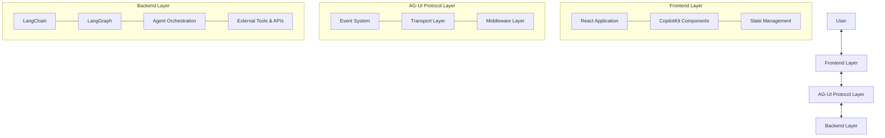
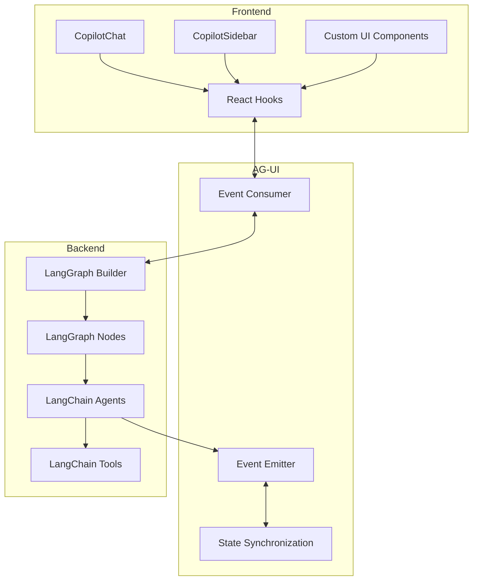
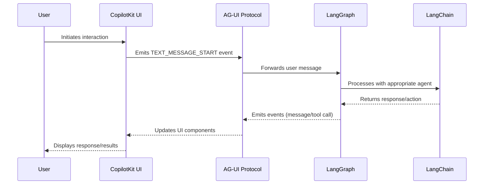
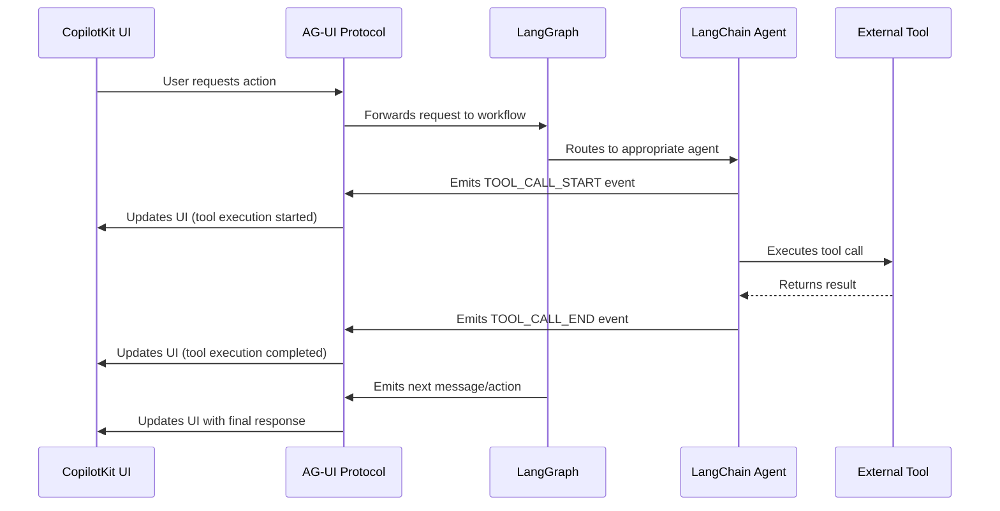
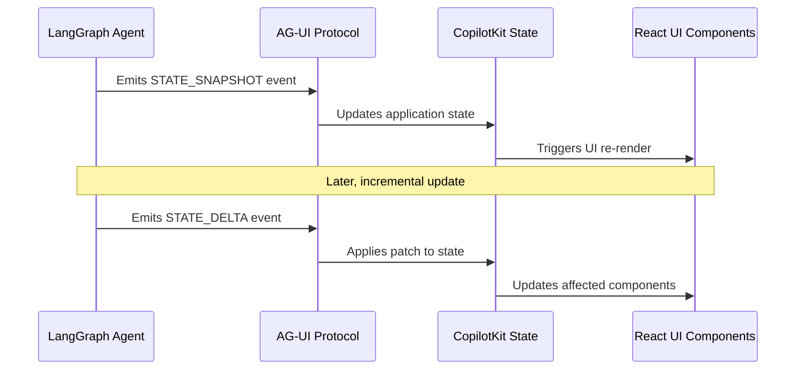

# Citadel Integration Architecture

## Executive Summary

Project Citadel's architecture leverages four key technologies—AG-UI, CopilotKit, LangChain, and LangGraph—to create a cohesive, powerful agent-based system with a responsive user interface. This document details how these technologies integrate to form a unified platform that enables sophisticated AI agent interactions while maintaining a seamless user experience.

The integration architecture follows these core principles:
- **Event-driven communication**: Using AG-UI's standardized event protocol to connect frontend and backend components
- **Modular agent orchestration**: Employing LangGraph for complex, stateful agent workflows
- **Unified state management**: Synchronizing UI state with agent state through CopilotKit's integration patterns
- **Extensible component design**: Supporting future enhancements through well-defined API contracts

This document provides detailed information about integration points, data flows, state management strategies, and implementation patterns to guide the frontend implementation in MVP-2.

## Technology Overview

### AG-UI

AG-UI (Agent User Interaction Protocol) serves as the standardized communication layer between AI backend agents and frontend applications in Project Citadel.

#### Role in the System
- Provides a lightweight, event-driven architecture for agent-UI communication
- Standardizes 16 event types for message streaming, tool calls, state updates, and lifecycle signals
- Abstracts transport mechanisms (HTTP SSE, WebSockets, etc.) to ensure flexibility

#### Key Components
- **Protocol Layer**: Defines standard event types for agent-UI communication
- **Middleware Layer**: Ensures compatibility across different environments and frameworks
- **Transport Layer**: Supports multiple transport mechanisms for real-time communication
- **Event System**: All communication based on typed events inheriting from `BaseEvent`
- **State Management**: Supports efficient state synchronization through snapshots and deltas

### CopilotKit

CopilotKit provides the framework for embedding AI copilots and chatbots into the Citadel application, offering pre-built UI components and integration patterns.

#### Role in the System
- Supplies React components for chat interfaces, sidebars, and interactive elements
- Manages conversation state and grounds AI in application-specific data
- Facilitates backend integration through Next.js API routes
- Enables multi-agent orchestration through its CoAgents framework

#### Key Components
- **UI Components**: Pre-built React components (`CopilotChat`, `CopilotSidebar`, etc.)
- **Hooks for State and Actions**: Manages conversation state and triggers actions
- **Backend Integration**: Connects frontend components with backend services
- **CoAgents Framework**: Orchestrates multiple AI agents with specialized responsibilities

### LangChain

LangChain serves as the foundation for building LLM-powered applications in Project Citadel, providing tools, chains, and agents.

#### Role in the System
- Offers a comprehensive framework for developing LLM applications
- Provides tools for interacting with various models and APIs
- Enables the creation of chains for sequential processing
- Supports agent development with reasoning capabilities

#### Key Components
- **LLM Integration**: Interfaces with various language models
- **Chains**: Sequences of operations for processing inputs and generating outputs
- **Tools**: Utilities for performing specific tasks (web search, calculation, etc.)
- **Memory**: Components for maintaining conversation history and context

### LangGraph

LangGraph extends LangChain's capabilities by providing a graph-based orchestration layer for complex, stateful agent workflows.

#### Role in the System
- Manages complex, stateful, multi-agent workflows
- Enables conditional routing between different nodes (functions or models)
- Maintains persistent state for long-running, autonomous agents
- Provides observability and tracing capabilities

#### Key Components
- **StateGraph**: Core component for defining and managing workflow graphs
- **Nodes**: Functions or classes that perform specific tasks
- **Edges**: Connections between nodes with conditional routing
- **State Management**: Maintains persistent state across interactions
- **Tracing and Observability**: Integration with tools like LangSmith for debugging

## Integration Diagrams

### High-Level System Architecture



### Component Integration



## Data Flow Maps

### User Interaction Flow



### Tool Execution Flow



### State Synchronization Flow



## State Management Strategy

### Agent State Synchronization

Project Citadel employs a hybrid state management approach that leverages AG-UI's event system and CopilotKit's state hooks to maintain synchronization between agent state and UI components.

#### Core Principles

1. **Single Source of Truth**: Agent state is the authoritative source, with UI state derived from it
2. **Event-Driven Updates**: State changes propagate through AG-UI events
3. **Efficient Synchronization**: Using snapshots for initial state and deltas for updates
4. **Reactive UI**: React components respond to state changes through hooks

#### Implementation Strategy

1. **Agent State Definition**:
   - LangGraph maintains the primary state object
   - State schema is defined using TypedDict or similar structures
   - State includes conversation history, tool states, and application context

2. **State Transmission**:
   - `STATE_SNAPSHOT` events provide complete state at key points
   - `STATE_DELTA` events use JSON Patch for efficient incremental updates
   - `MESSAGES_SNAPSHOT` events synchronize conversation history

3. **Frontend State Management**:
   - CopilotKit's `useCopilotChat` and `useCopilotReadable` hooks consume AG-UI events
   - React's Context API distributes state to relevant components
   - Custom hooks transform agent state into UI-friendly formats

4. **Bidirectional Updates**:
   - UI actions trigger events that update agent state
   - Agent state changes trigger UI updates through the event system
   - Conflict resolution prioritizes agent state in case of discrepancies

### State Synchronization Code Example

```typescript
// Backend: LangGraph state definition
type CitadelState = {
  conversation: Message[];
  tools: ToolState;
  context: ApplicationContext;
  ui: UIState;
};

// Backend: Emitting state updates
function updateState(graph: StateGraph, newState: Partial<CitadelState>) {
  const currentState = graph.getState();
  const updatedState = { ...currentState, ...newState };
  
  // Emit full snapshot periodically or on significant changes
  if (shouldEmitSnapshot(currentState, updatedState)) {
    emitEvent({
      type: "STATE_SNAPSHOT",
      payload: updatedState
    });
  } else {
    // Create JSON Patch for incremental updates
    const patch = createPatch(currentState, updatedState);
    emitEvent({
      type: "STATE_DELTA",
      payload: patch
    });
  }
}

// Frontend: Consuming state updates with CopilotKit
function CitadelApp() {
  const { state, messages, sendMessage } = useCopilotChat();
  
  // Access synchronized state
  const { tools, context, ui } = state;
  
  // Use state in UI components
  return (
    <CopilotChatContainer>
      <ToolPanel tools={tools} />
      <ChatInterface messages={messages} onSend={sendMessage} />
      <ContextPanel context={context} />
    </CopilotChatContainer>
  );
}
```

## API Contracts

### AG-UI to CopilotKit Integration

| Event Type | Payload | Description |
|------------|---------|-------------|
| `RUN_STARTED` | `{ runId: string }` | Indicates the start of an agent execution |
| `RUN_FINISHED` | `{ runId: string }` | Indicates the completion of an agent execution |
| `TEXT_MESSAGE_START` | `{ messageId: string, sender: string }` | Begins a new message in the conversation |
| `TEXT_MESSAGE_CONTENT` | `{ messageId: string, content: string }` | Streams content for the current message |
| `TEXT_MESSAGE_END` | `{ messageId: string }` | Completes the current message |
| `TOOL_CALL_START` | `{ toolCallId: string, tool: string }` | Begins a tool execution |
| `TOOL_CALL_ARGS` | `{ toolCallId: string, args: object }` | Provides arguments for the tool call |
| `TOOL_CALL_END` | `{ toolCallId: string, result: object }` | Completes the tool execution with results |
| `STATE_SNAPSHOT` | `{ state: object }` | Provides a complete state snapshot |
| `STATE_DELTA` | `{ patch: JSONPatch[] }` | Provides incremental state updates |

### CopilotKit to LangGraph Integration

```typescript
// API contract for agent execution
interface AgentExecutionRequest {
  messages: Message[];
  tools?: Tool[];
  context?: object;
  metadata?: object;
}

interface AgentExecutionResponse {
  events: AGUIEvent[];
  finalState?: object;
}

// API endpoint definition
async function executeAgent(req: AgentExecutionRequest): Promise<AgentExecutionResponse> {
  // Implementation details
}
```

### LangChain to LangGraph Integration

```python
# Node definition contract
def node_function(state: dict) -> dict:
    """
    Process the current state and return an updated state.
    
    Args:
        state: The current state object
        
    Returns:
        Updated state object
    """
    # Implementation details
    return updated_state

# Router function contract
def router_function(state: dict) -> str:
    """
    Determine the next node based on the current state.
    
    Args:
        state: The current state object
        
    Returns:
        Name of the next node to execute
    """
    # Implementation details
    return next_node_name
```

## Implementation Examples

### AG-UI Event Handling in CopilotKit

```typescript
// Setting up AG-UI event handling in CopilotKit
import { HttpAgent } from 'ag-ui';
import { useCopilotChat } from '@copilotkit/react-core';

function CitadelChatComponent() {
  const { messages, sendMessage, updateState } = useCopilotChat();
  
  useEffect(() => {
    // Initialize AG-UI agent
    const agent = new HttpAgent({
      baseUrl: '/api/agent',
    });
    
    // Subscribe to AG-UI events
    agent.runAgent({}).subscribe({
      next: (event) => {
        switch (event.type) {
          case 'TEXT_MESSAGE_START':
            // Handle message start
            break;
          case 'TEXT_MESSAGE_CONTENT':
            // Handle message content
            break;
          case 'TEXT_MESSAGE_END':
            // Handle message end
            break;
          case 'TOOL_CALL_START':
            // Handle tool call start
            break;
          case 'TOOL_CALL_END':
            // Handle tool call end
            break;
          case 'STATE_SNAPSHOT':
          case 'STATE_DELTA':
            // Update application state
            updateState(event.payload);
            break;
        }
      },
      error: (err) => {
        console.error('Agent error:', err);
      },
      complete: () => {
        console.log('Agent execution completed');
      }
    });
  }, []);
  
  return (
    <div className="chat-container">
      {/* Chat UI implementation */}
    </div>
  );
}
```

### LangGraph Integration with LangChain

```python
from langchain.chat_models import ChatOpenAI
from langchain.schema import HumanMessage, AIMessage
from langgraph.graph import StateGraph
from typing import TypedDict, List, Union

# Define state schema
class CitadelState(TypedDict):
    messages: List[Union[HumanMessage, AIMessage]]
    context: dict
    tools: dict
    ui_state: dict

# Initialize language model
llm = ChatOpenAI()

# Define nodes
def process_user_input(state: CitadelState) -> CitadelState:
    """Process user input and update state."""
    # Implementation details
    return state

def generate_response(state: CitadelState) -> CitadelState:
    """Generate AI response using LangChain."""
    messages = state["messages"]
    response = llm.invoke(messages)
    
    # Update state with AI response
    state["messages"].append(response)
    return state

def execute_tool(state: CitadelState) -> CitadelState:
    """Execute tool based on AI decision."""
    # Implementation details
    return state

def update_ui_state(state: CitadelState) -> CitadelState:
    """Update UI state based on current state."""
    # Implementation details
    return state

# Define router for conditional flow
def router(state: CitadelState) -> str:
    """Determine next node based on state."""
    last_message = state["messages"][-1]
    
    if "tool_calls" in last_message.additional_kwargs:
        return "execute_tool"
    else:
        return "update_ui_state"

# Build graph
graph_builder = StateGraph(CitadelState)
graph_builder.add_node("process_user_input", process_user_input)
graph_builder.add_node("generate_response", generate_response)
graph_builder.add_node("execute_tool", execute_tool)
graph_builder.add_node("update_ui_state", update_ui_state)

# Define edges
graph_builder.add_edge("process_user_input", "generate_response")
graph_builder.add_conditional_edges("generate_response", router)
graph_builder.add_edge("execute_tool", "update_ui_state")
graph_builder.add_edge("update_ui_state", "process_user_input")

# Compile graph
graph = graph_builder.compile()
```

### CopilotKit UI Component Integration

```tsx
// React component using CopilotKit
import { CopilotChat, CopilotSidebar } from '@copilotkit/react-ui';
import { useCopilotAction, useCopilotReadable } from '@copilotkit/react-core';

function CitadelDashboard() {
  // Register application context for the copilot
  useCopilotReadable("user", { name: "John Doe", role: "Admin" });
  useCopilotReadable("project", { name: "Project Citadel", status: "Active" });
  
  // Register actions that the copilot can perform
  const executeSearch = useCopilotAction({
    name: "search",
    description: "Search for information in the system",
    parameters: [
      { name: "query", type: "string", description: "Search query" }
    ],
    handler: async ({ query }) => {
      // Implementation details
      return searchResults;
    }
  });
  
  return (
    <div className="dashboard-container">
      <CopilotSidebar>
        <CopilotChat
          className="citadel-chat"
          placeholder="Ask Citadel anything..."
          messageClassName="chat-message"
        />
      </CopilotSidebar>
      
      <main className="dashboard-content">
        {/* Dashboard content */}
      </main>
    </div>
  );
}
```

## Testing Strategy

### Integration Testing Approach

Project Citadel employs a comprehensive testing strategy to validate the integration between AG-UI, CopilotKit, LangChain, and LangGraph components:

1. **Unit Testing**
   - Test individual components in isolation
   - Mock dependencies to focus on component behavior
   - Validate component contracts and interfaces

2. **Contract Testing**
   - Verify that components adhere to defined API contracts
   - Test data serialization/deserialization between components
   - Ensure backward compatibility when contracts evolve

3. **Integration Testing**
   - Test interactions between connected components
   - Validate event propagation through the system
   - Ensure proper state synchronization

4. **End-to-End Testing**
   - Test complete user workflows
   - Validate system behavior from user input to final output
   - Ensure all components work together correctly

### Testing Tools and Frameworks

| Layer | Testing Tools | Focus Areas |
|-------|--------------|-------------|
| Frontend | Jest, React Testing Library | UI components, hooks, state management |
| AG-UI | Jest, RxJS testing utilities | Event emission, subscription, transformation |
| Backend | Pytest, LangChain test utils | Agent behavior, tool execution, state management |
| End-to-End | Playwright, Cypress | User workflows, system integration |

### Testing Implementation Examples

#### Frontend Component Testing

```typescript
// Testing CopilotKit integration with AG-UI events
import { render, screen, fireEvent } from '@testing-library/react';
import { MockAgent } from 'ag-ui-test-utils';
import { CitadelChatComponent } from './CitadelChatComponent';

test('handles TEXT_MESSAGE events correctly', async () => {
  // Setup mock AG-UI agent
  const mockAgent = new MockAgent();
  
  // Render component with mock agent
  render(<CitadelChatComponent agent={mockAgent} />);
  
  // Simulate user input
  fireEvent.change(screen.getByPlaceholder('Ask Citadel...'), {
    target: { value: 'Hello' }
  });
  fireEvent.click(screen.getByText('Send'));
  
  // Simulate AG-UI events
  mockAgent.emitEvent({
    type: 'TEXT_MESSAGE_START',
    payload: { messageId: '123', sender: 'ai' }
  });
  
  mockAgent.emitEvent({
    type: 'TEXT_MESSAGE_CONTENT',
    payload: { messageId: '123', content: 'Hello, how can I help?' }
  });
  
  mockAgent.emitEvent({
    type: 'TEXT_MESSAGE_END',
    payload: { messageId: '123' }
  });
  
  // Assert UI updates correctly
  expect(await screen.findByText('Hello, how can I help?')).toBeInTheDocument();
});
```

#### LangGraph Integration Testing

```python
import pytest
from langchain.schema import HumanMessage
from citadel.graph import build_citadel_graph

def test_graph_execution_flow():
    # Build test graph
    graph = build_citadel_graph()
    
    # Initialize test state
    initial_state = {
        "messages": [HumanMessage(content="Hello")],
        "context": {},
        "tools": {},
        "ui_state": {}
    }
    
    # Execute graph
    final_state = graph.invoke(initial_state)
    
    # Assert expected state transitions
    assert len(final_state["messages"]) > 1
    assert "AI" in final_state["messages"][-1].content
    assert "ui_state" in final_state
    assert final_state["ui_state"] != {}
```

#### End-to-End Testing

```typescript
// Playwright E2E test
import { test, expect } from '@playwright/test';

test('complete user interaction flow', async ({ page }) => {
  // Navigate to application
  await page.goto('http://localhost:3000');
  
  // Interact with chat
  await page.fill('[placeholder="Ask Citadel..."]', 'Search for project documents');
  await page.click('button:has-text("Send")');
  
  // Wait for response and tool execution
  await expect(page.locator('.ai-message')).toContainText('I can help you search');
  await expect(page.locator('.tool-execution')).toBeVisible();
  
  // Verify search results appear
  await expect(page.locator('.search-results')).toBeVisible();
  await expect(page.locator('.search-results-item')).toHaveCount.greaterThan(0);
});
```

## Conclusion

The integration architecture described in this document provides a comprehensive framework for connecting AG-UI, CopilotKit, LangChain, and LangGraph in Project Citadel. By following the patterns, contracts, and implementation examples outlined here, the development team can ensure a cohesive and maintainable system that leverages the strengths of each technology.

Key takeaways:
- AG-UI provides the standardized event protocol for agent-UI communication
- CopilotKit offers pre-built UI components and state management hooks
- LangChain enables powerful LLM-based agent capabilities
- LangGraph orchestrates complex, stateful agent workflows

This integration architecture sets the foundation for the frontend implementation in MVP-2, ensuring alignment on how these core components work together to deliver a seamless user experience.

## References

1. AG-UI Protocol Documentation: [Core architecture - docs.ag-ui.com](https://docs.ag-ui.com/concepts/architecture)
2. CopilotKit Documentation: [CopilotKit Documentation](https://docs.copilotkit.ai/ag2/concepts/ag2)
3. LangChain Documentation: [LangChain](https://python.langchain.com/docs/get_started/introduction)
4. LangGraph Documentation: [LangGraph](https://python.langchain.com/docs/langgraph)
5. React State Management: [Managing State in React](https://react.dev/learn/managing-state)
