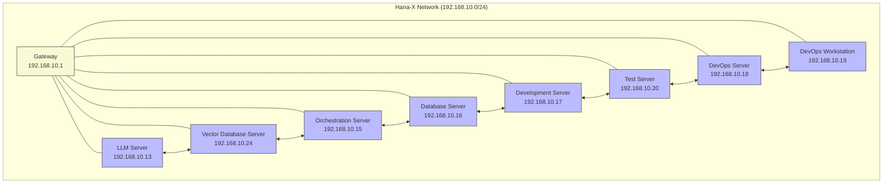
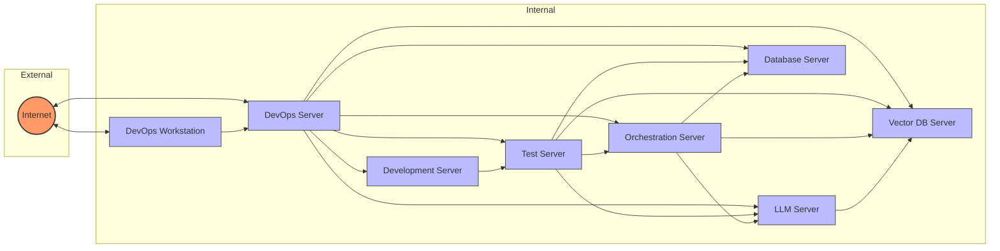

# Hana-X Technical Landscape: Infrastructure Configuration Plan

## Executive Summary

This document outlines the comprehensive infrastructure configuration plan for the Hana-X technical landscape, consisting of eight dedicated servers with specific roles. The infrastructure is designed to support local AI inference, vector database operations, workflow orchestration, database management, development, testing, and DevOps activities.

The plan provides detailed specifications for each server, including hardware requirements, operating system configurations, software installation procedures, security measures, and networking setup. It also includes network architecture diagrams showing the communication patterns between servers, step-by-step implementation instructions, and guidelines for maintenance and troubleshooting.

This infrastructure is designed with security, scalability, and performance in mind, following industry best practices and leveraging modern technologies to create a robust foundation for the Hana-X platform.

## Network Architecture

The Hana-X technical landscape consists of eight dedicated servers organized in a flat network structure. The network architecture implements security best practices, including secure communication channels and restricted access controls.

### Network Diagram



### Communication Flow



### IP Addressing Scheme

| Server | IP Address | Subnet Mask | Gateway |
|--------|------------|-------------|---------|
| LLM Server | 192.168.10.13 | 255.255.255.0 | 192.168.10.1 |
| Vector Database Server | 192.168.10.24 | 255.255.255.0 | 192.168.10.1 |
| Orchestration Server | 192.168.10.15 | 255.255.255.0 | 192.168.10.1 |
| Database Server | 192.168.10.16 | 255.255.255.0 | 192.168.10.1 |
| Development Server | 192.168.10.17 | 255.255.255.0 | 192.168.10.1 |
| Test Server | 192.168.10.20 | 255.255.255.0 | 192.168.10.1 |
| DevOps Server | 192.168.10.18 | 255.255.255.0 | 192.168.10.1 |
| DevOps Workstation | 192.168.10.19 | 255.255.255.0 | 192.168.10.1 |

### Secure Communication

- All inter-server communication will be encrypted using TLS 1.3
- A WireGuard VPN will be configured for secure remote access
- Firewall rules will restrict traffic based on the principle of least privilege

## Server Configurations

### 1. LLM Server

#### Hardware Specifications

| Component | Specification | Justification |
|-----------|---------------|--------------|
| CPU | AMD EPYC 7443 24-Core Processor (3.0 GHz base, 4.0 GHz boost) | High core count for parallel processing |
| RAM | 128 GB DDR4-3200 ECC | Required for large language models (70B+) |
| Storage | 2 TB NVMe SSD (Primary), 4 TB SSD (Data) | Fast storage for model loading and inference |
| GPU | NVIDIA A100 (40 GB VRAM) | High VRAM for large model inference |
| Network | Dual 10 Gbps Ethernet | High bandwidth for model distribution |
| Power Supply | 1200W Redundant | Reliability for high-performance components |

#### Operating System Configuration

- **Base OS**: Ubuntu 24.04 LTS Server
- **Kernel**: Linux 6.8 or later with NVIDIA driver support
- **Filesystem**: XFS for data partition (better performance with large files)
- **Swap**: 16 GB (minimal swap due to high RAM)

#### Software Stack

- **NVIDIA Driver**: Latest stable version (535.x or newer)
- **CUDA Toolkit**: 12.x or newer
- **Docker**: Latest stable version with NVIDIA Container Toolkit
- **Ollama**: Latest stable version

#### Security Configuration

- Implement CIS Level 1 hardening for Ubuntu 24.04
- Configure UFW firewall to allow only necessary ports:
  - 22/TCP (SSH, restricted to internal network)
  - 11434/TCP (Ollama API)
- Enable automatic security updates
- Implement fail2ban for SSH protection
- Configure SELinux in enforcing mode
- Disable root login and use SSH key authentication only

#### Networking Setup

- Primary interface: ens160 (192.168.10.13/24)
- Default gateway: 192.168.10.1
- DNS servers: 192.168.10.18 (internal), 1.1.1.1 (external)
- NTP configuration: chrony with internal time server

#### Implementation Instructions

1. **Base OS Installation**:
   ```bash
   # Boot from Ubuntu 24.04 LTS Server ISO
   # During installation, configure:
   # - Hostname: llm-server
   # - Username: hana-admin
   # - Partitioning: 100GB / (root), remainder for /data
   # - Install OpenSSH server
   ```

2. **System Updates and Basic Configuration**:
   ```bash
   sudo apt update && sudo apt upgrade -y
   sudo apt install -y build-essential git curl wget htop iotop iftop net-tools
   
   # Set timezone
   sudo timedatectl set-timezone UTC
   
   # Configure NTP
   sudo apt install -y chrony
   sudo systemctl enable chrony
   sudo systemctl start chrony
   ```

3. **NVIDIA Driver and CUDA Installation**:
   ```bash
   sudo apt install -y nvidia-driver-535 nvidia-utils-535
   
   # Install CUDA Toolkit
   wget https://developer.download.nvidia.com/compute/cuda/12.3.0/local_installers/cuda_12.3.0_545.23.06_linux.run
   sudo sh cuda_12.3.0_545.23.06_linux.run --silent --toolkit
   
   # Add CUDA to PATH
   echo 'export PATH=/usr/local/cuda/bin:$PATH' >> ~/.bashrc
   echo 'export LD_LIBRARY_PATH=/usr/local/cuda/lib64:$LD_LIBRARY_PATH' >> ~/.bashrc
   source ~/.bashrc
   ```

4. **Docker Installation**:
   ```bash
   # Install Docker
   curl -fsSL https://get.docker.com -o get-docker.sh
   sudo sh get-docker.sh
   
   # Add user to docker group
   sudo usermod -aG docker $USER
   
   # Install NVIDIA Container Toolkit
   distribution=$(. /etc/os-release;echo $ID$VERSION_ID)
   curl -s -L https://nvidia.github.io/nvidia-docker/gpgkey | sudo apt-key add -
   curl -s -L https://nvidia.github.io/nvidia-docker/$distribution/nvidia-docker.list | sudo tee /etc/apt/sources.list.d/nvidia-docker.list
   sudo apt update && sudo apt install -y nvidia-container-toolkit
   sudo systemctl restart docker
   ```

5. **Ollama Installation and Configuration**:
   ```bash
   # Install Ollama
   curl -fsSL https://ollama.com/install.sh | sh
   
   # Configure Ollama to start on boot
   sudo tee /etc/systemd/system/ollama.service > /dev/null << 'EOF'
   [Unit]
   Description=Ollama Service
   After=network.target
   
   [Service]
   Type=simple
   User=hana-admin
   ExecStart=/usr/local/bin/ollama serve
   Restart=always
   RestartSec=3
   
   [Install]
   WantedBy=multi-user.target
   EOF
   
   sudo systemctl daemon-reload
   sudo systemctl enable ollama
   sudo systemctl start ollama
   
   # Pull required models
   ollama pull llama3:70b
   ollama pull mistral:7b
   ollama pull codellama:34b
   ```

6. **Security Hardening**:
   ```bash
   # Install security tools
   sudo apt install -y ufw fail2ban unattended-upgrades

   # Enable automatic updates
   sudo dpkg-reconfigure -plow unattended-upgrades
   
   # Configure firewall
   sudo ufw default deny incoming
   sudo ufw default allow outgoing
   sudo ufw allow from 192.168.10.0/24 to any port 22 proto tcp
   sudo ufw allow from 192.168.10.0/24 to any port 11434 proto tcp
   sudo ufw enable
   
   # Configure fail2ban
   sudo cp /etc/fail2ban/jail.conf /etc/fail2ban/jail.local
   sudo systemctl enable fail2ban
   sudo systemctl start fail2ban
   
   # Apply CIS hardening
   sudo apt install -y ubuntu-pro-client
   sudo pro enable usg
   sudo apt install -y usg
   sudo usg fix cis_level1_server
   ```

### 2. Vector Database Server

#### Hardware Specifications

| Component | Specification | Justification |
|-----------|---------------|--------------|
| CPU | AMD EPYC 7313 16-Core Processor (3.0 GHz base, 3.7 GHz boost) | Good balance of cores and frequency |
| RAM | 64 GB DDR4-3200 ECC | Sufficient for vector database operations |
| Storage | 1 TB NVMe SSD (Primary), 2 TB SSD (Data) | Fast storage for vector database |
| GPU | None required | Vector operations handled by CPU |
| Network | Dual 10 Gbps Ethernet | High bandwidth for data transfer |
| Power Supply | 750W Redundant | Reliability for server components |

#### Operating System Configuration

- **Base OS**: Ubuntu 24.04 LTS Server
- **Kernel**: Linux 6.8 or later
- **Filesystem**: XFS for data partition
- **Swap**: 8 GB

#### Software Stack

- **Docker**: Latest stable version
- **Docker Compose**: Latest stable version
- **Qdrant**: Latest stable version (Docker container)

#### Security Configuration

- Implement CIS Level 1 hardening for Ubuntu 24.04
- Configure UFW firewall to allow only necessary ports:
  - 22/TCP (SSH, restricted to internal network)
  - 6333/TCP (Qdrant HTTP API)
  - 6334/TCP (Qdrant gRPC API)
- Enable automatic security updates
- Implement fail2ban for SSH protection
- Configure SELinux in enforcing mode
- Disable root login and use SSH key authentication only

#### Networking Setup

- Primary interface: ens160 (192.168.10.24/24)
- Default gateway: 192.168.10.1
- DNS servers: 192.168.10.18 (internal), 1.1.1.1 (external)
- NTP configuration: chrony with internal time server

#### Implementation Instructions

1. **Base OS Installation**:
   ```bash
   # Boot from Ubuntu 24.04 LTS Server ISO
   # During installation, configure:
   # - Hostname: vector-db-server
   # - Username: hana-admin
   # - Partitioning: 100GB / (root), remainder for /data
   # - Install OpenSSH server
   ```

2. **System Updates and Basic Configuration**:
   ```bash
   sudo apt update && sudo apt upgrade -y
   sudo apt install -y build-essential git curl wget htop iotop iftop net-tools
   
   # Set timezone
   sudo timedatectl set-timezone UTC
   
   # Configure NTP
   sudo apt install -y chrony
   sudo systemctl enable chrony
   sudo systemctl start chrony
   ```

3. **Docker Installation**:
   ```bash
   # Install Docker
   curl -fsSL https://get.docker.com -o get-docker.sh
   sudo sh get-docker.sh
   
   # Add user to docker group
   sudo usermod -aG docker $USER
   
   # Install Docker Compose
   sudo apt install -y docker-compose-plugin
   ```

4. **Qdrant Installation and Configuration**:
   ```bash
   # Create directory for Qdrant data
   sudo mkdir -p /data/qdrant
   sudo chown -R hana-admin:hana-admin /data/qdrant
   
   # Create Docker Compose file
   mkdir -p ~/qdrant
   cat > ~/qdrant/docker-compose.yml << 'EOF'
   version: '3'
   services:
     qdrant:
       image: qdrant/qdrant:latest
       ports:
         - "6333:6333"
         - "6334:6334"
       volumes:
         - /data/qdrant:/qdrant/storage
       environment:
         - QDRANT_ALLOW_RECOVERY_MODE=true
       restart: always
       healthcheck:
         test: ["CMD", "curl", "-f", "http://localhost:6333/readiness"]
         interval: 30s
         timeout: 10s
         retries: 3
   EOF
   
   # Start Qdrant
   cd ~/qdrant
   docker-compose up -d
   ```

5. **Security Hardening**:
   ```bash
   # Install security tools
   sudo apt install -y ufw fail2ban unattended-upgrades

   # Enable automatic updates
   sudo dpkg-reconfigure -plow unattended-upgrades
   
   # Configure firewall
   sudo ufw default deny incoming
   sudo ufw default allow outgoing
   sudo ufw allow from 192.168.10.0/24 to any port 22 proto tcp
   sudo ufw allow from 192.168.10.0/24 to any port 6333 proto tcp
   sudo ufw allow from 192.168.10.0/24 to any port 6334 proto tcp
   sudo ufw enable
   
   # Configure fail2ban
   sudo cp /etc/fail2ban/jail.conf /etc/fail2ban/jail.local
   sudo systemctl enable fail2ban
   sudo systemctl start fail2ban
   
   # Apply CIS hardening
   sudo apt install -y ubuntu-pro-client
   sudo pro enable usg
   sudo apt install -y usg
   sudo usg fix cis_level1_server
   ```

### 3. Orchestration Server

#### Hardware Specifications

| Component | Specification | Justification |
|-----------|---------------|--------------|
| CPU | Intel Xeon Gold 6326 16-Core (2.9 GHz base, 3.5 GHz boost) | Good performance for workflow orchestration |
| RAM | 32 GB DDR4-3200 ECC | Sufficient for n8n operations |
| Storage | 512 GB NVMe SSD (Primary), 1 TB SSD (Data) | Fast storage for workflow data |
| GPU | None required | Not needed for orchestration tasks |
| Network | Dual 1 Gbps Ethernet | Standard connectivity |
| Power Supply | 550W Redundant | Reliability for server components |

#### Operating System Configuration

- **Base OS**: Ubuntu 24.04 LTS Server
- **Kernel**: Linux 6.8 or later
- **Filesystem**: ext4
- **Swap**: 8 GB

#### Software Stack

- **Docker**: Latest stable version
- **Docker Compose**: Latest stable version
- **n8n**: Latest stable version (Docker container)
- **Redis**: Latest stable version (Docker container)
- **PostgreSQL**: Latest stable version (Docker container, for n8n)

#### Security Configuration

- Implement CIS Level 1 hardening for Ubuntu 24.04
- Configure UFW firewall to allow only necessary ports:
  - 22/TCP (SSH, restricted to internal network)
  - 5678/TCP (n8n web interface)
- Enable automatic security updates
- Implement fail2ban for SSH protection
- Configure SELinux in enforcing mode
- Disable root login and use SSH key authentication only

#### Networking Setup

- Primary interface: ens160 (192.168.10.15/24)
- Default gateway: 192.168.10.1
- DNS servers: 192.168.10.18 (internal), 1.1.1.1 (external)
- NTP configuration: chrony with internal time server

#### Implementation Instructions

1. **Base OS Installation**:
   ```bash
   # Boot from Ubuntu 24.04 LTS Server ISO
   # During installation, configure:
   # - Hostname: orchestration-server
   # - Username: hana-admin
   # - Partitioning: 100GB / (root), remainder for /data
   # - Install OpenSSH server
   ```

2. **System Updates and Basic Configuration**:
   ```bash
   sudo apt update && sudo apt upgrade -y
   sudo apt install -y build-essential git curl wget htop iotop iftop net-tools
   
   # Set timezone
   sudo timedatectl set-timezone UTC
   
   # Configure NTP
   sudo apt install -y chrony
   sudo systemctl enable chrony
   sudo systemctl start chrony
   ```

3. **Docker Installation**:
   ```bash
   # Install Docker
   curl -fsSL https://get.docker.com -o get-docker.sh
   sudo sh get-docker.sh
   
   # Add user to docker group
   sudo usermod -aG docker $USER
   
   # Install Docker Compose
   sudo apt install -y docker-compose-plugin
   ```

4. **n8n Installation and Configuration**:
   ```bash
   # Create directory for n8n data
   sudo mkdir -p /data/n8n
   sudo chown -R hana-admin:hana-admin /data/n8n
   
   # Create Docker Compose file
   mkdir -p ~/n8n
   cat > ~/n8n/docker-compose.yml << 'EOF'
   version: '3'
   services:
     n8n:
       image: n8nio/n8n:latest
       restart: always
       ports:
         - "5678:5678"
       environment:
         - N8N_HOST=orchestration-server
         - N8N_PORT=5678
         - N8N_PROTOCOL=http
         - N8N_METRICS=true
         - DB_TYPE=postgresdb
         - DB_POSTGRESDB_HOST=postgres
         - DB_POSTGRESDB_PORT=5432
         - DB_POSTGRESDB_DATABASE=n8n
         - DB_POSTGRESDB_USER=n8n
         - DB_POSTGRESDB_PASSWORD=n8n_password
         - EXECUTIONS_MODE=queue
         - QUEUE_BULL_REDIS_HOST=redis
         - QUEUE_HEALTH_CHECK_ACTIVE=true
         - NODE_ENV=production
       volumes:
         - /data/n8n:/home/node/.n8n
       depends_on:
         - postgres
         - redis
   
     postgres:
       image: postgres:14
       restart: always
       environment:
         - POSTGRES_USER=n8n
         - POSTGRES_PASSWORD=n8n_password
         - POSTGRES_DB=n8n
         - POSTGRES_NON_ROOT_USER=n8n
         - POSTGRES_NON_ROOT_PASSWORD=n8n_password
       volumes:
         - /data/n8n/postgres:/var/lib/postgresql/data
       healthcheck:
         test: ["CMD-SHELL", "pg_isready -U n8n"]
         interval: 10s
         timeout: 5s
         retries: 3
   
     redis:
       image: redis:7-alpine
       restart: always
       command: redis-server --appendonly yes
       volumes:
         - /data/n8n/redis:/data
       healthcheck:
         test: ["CMD", "redis-cli", "ping"]
         interval: 10s
         timeout: 5s
         retries: 5
   EOF
   
   # Start n8n
   cd ~/n8n
   docker-compose up -d
   ```

5. **Security Hardening**:
   ```bash
   # Install security tools
   sudo apt install -y ufw fail2ban unattended-upgrades

   # Enable automatic updates
   sudo dpkg-reconfigure -plow unattended-upgrades
   
   # Configure firewall
   sudo ufw default deny incoming
   sudo ufw default allow outgoing
   sudo ufw allow from 192.168.10.0/24 to any port 22 proto tcp
   sudo ufw allow from 192.168.10.0/24 to any port 5678 proto tcp
   sudo ufw enable
   
   # Configure fail2ban
   sudo cp /etc/fail2ban/jail.conf /etc/fail2ban/jail.local
   sudo systemctl enable fail2ban
   sudo systemctl start fail2ban
   
   # Apply CIS hardening
   sudo apt install -y ubuntu-pro-client
   sudo pro enable usg
   sudo apt install -y usg
   sudo usg fix cis_level1_server
   ```

### 4. Database Server

#### Hardware Specifications

| Component | Specification | Justification |
|-----------|---------------|--------------|
| CPU | Intel Xeon Gold 6330 28-Core (2.0 GHz base, 3.1 GHz boost) | High core count for database operations |
| RAM | 64 GB DDR4-3200 ECC | Sufficient for PostgreSQL operations |
| Storage | 1 TB NVMe SSD (Primary), 4 TB SSD RAID 10 (Data) | Fast, redundant storage for database |
| GPU | None required | Not needed for database operations |
| Network | Dual 10 Gbps Ethernet | High bandwidth for data transfer |
| Power Supply | 750W Redundant | Reliability for server components |

#### Operating System Configuration

- **Base OS**: Ubuntu 24.04 LTS Server
- **Kernel**: Linux 6.8 or later
- **Filesystem**: XFS for data partition
- **Swap**: 16 GB

#### Software Stack

- **Docker**: Latest stable version
- **Docker Compose**: Latest stable version
- **Supabase**: Latest stable version (Docker container)
- **PostgreSQL**: Latest stable version (part of Supabase)

#### Security Configuration

- Implement CIS Level 1 hardening for Ubuntu 24.04
- Configure UFW firewall to allow only necessary ports:
  - 22/TCP (SSH, restricted to internal network)
  - 3000/TCP (Supabase Studio)
  - 5432/TCP (PostgreSQL, restricted to internal network)
  - 8000/TCP (Supabase API)
- Enable automatic security updates
- Implement fail2ban for SSH protection
- Configure SELinux in enforcing mode
- Disable root login and use SSH key authentication only

#### Networking Setup

- Primary interface: ens160 (192.168.10.16/24)
- Default gateway: 192.168.10.1
- DNS servers: 192.168.10.18 (internal), 1.1.1.1 (external)
- NTP configuration: chrony with internal time server

#### Implementation Instructions

1. **Base OS Installation**:
   ```bash
   # Boot from Ubuntu 24.04 LTS Server ISO
   # During installation, configure:
   # - Hostname: database-server
   # - Username: hana-admin
   # - Partitioning: 100GB / (root), remainder for /data
   # - Install OpenSSH server
   ```

2. **System Updates and Basic Configuration**:
   ```bash
   sudo apt update && sudo apt upgrade -y
   sudo apt install -y build-essential git curl wget htop iotop iftop net-tools
   
   # Set timezone
   sudo timedatectl set-timezone UTC
   
   # Configure NTP
   sudo apt install -y chrony
   sudo systemctl enable chrony
   sudo systemctl start chrony
   ```

3. **Docker Installation**:
   ```bash
   # Install Docker
   curl -fsSL https://get.docker.com -o get-docker.sh
   sudo sh get-docker.sh
   
   # Add user to docker group
   sudo usermod -aG docker $USER
   
   # Install Docker Compose
   sudo apt install -y docker-compose-plugin
   ```

4. **Supabase Installation and Configuration**:
   ```bash
   # Clone Supabase repository
   git clone https://github.com/supabase/supabase
   cd supabase/docker
   
   # Create .env file
   cp .env.example .env
   
   # Edit .env file to set secure passwords and configuration
   # Generate JWT secret
   openssl rand -base64 32
   
   # Update .env file with the generated JWT secret and other settings
   # Set POSTGRES_PASSWORD, JWT_SECRET, and other sensitive values
   
   # Start Supabase
   docker-compose up -d
   ```

5. **Security Hardening**:
   ```bash
   # Install security tools
   sudo apt install -y ufw fail2ban unattended-upgrades

   # Enable automatic updates
   sudo dpkg-reconfigure -plow unattended-upgrades
   
   # Configure firewall
   sudo ufw default deny incoming
   sudo ufw default allow outgoing
   sudo ufw allow from 192.168.10.0/24 to any port 22 proto tcp
   sudo ufw allow from 192.168.10.0/24 to any port 3000 proto tcp
   sudo ufw allow from 192.168.10.0/24 to any port 5432 proto tcp
   sudo ufw allow from 192.168.10.0/24 to any port 8000 proto tcp
   sudo ufw enable
   
   # Configure fail2ban
   sudo cp /etc/fail2ban/jail.conf /etc/fail2ban/jail.local
   sudo systemctl enable fail2ban
   sudo systemctl start fail2ban
   
   # Apply CIS hardening
   sudo apt install -y ubuntu-pro-client
   sudo pro enable usg
   sudo apt install -y usg
   sudo usg fix cis_level1_server
   ```

### 5. Development Server

#### Hardware Specifications

| Component | Specification | Justification |
|-----------|---------------|--------------|
| CPU | AMD Ryzen 9 5950X 16-Core (3.4 GHz base, 4.9 GHz boost) | High performance for development tasks |
| RAM | 64 GB DDR4-3600 | Sufficient for development environments |
| Storage | 1 TB NVMe SSD (Primary), 2 TB SSD (Data) | Fast storage for development |
| GPU | NVIDIA RTX A4000 (16 GB VRAM) | For AI/ML development testing |
| Network | Dual 1 Gbps Ethernet | Standard connectivity |
| Power Supply | 750W | Sufficient for components |

#### Operating System Configuration

- **Base OS**: Ubuntu 24.04 LTS Desktop
- **Kernel**: Linux 6.8 or later with NVIDIA driver support
- **Filesystem**: ext4
- **Swap**: 16 GB

#### Software Stack

- **Development Tools**: Git, VS Code, JetBrains IDEs, Docker, Docker Compose
- **Programming Languages**: Python, JavaScript/TypeScript, Go, Rust
- **Frameworks**: Node.js, React, Next.js, FastAPI, TensorFlow, PyTorch
- **Database Clients**: PostgreSQL client, MongoDB client, Redis client
- **Testing Tools**: Jest, Pytest, Selenium

#### Security Configuration

- Implement CIS Level 1 hardening for Ubuntu 24.04
- Configure UFW firewall to allow only necessary ports:
  - 22/TCP (SSH, restricted to internal network)
  - Various development ports as needed (restricted to internal network)
- Enable automatic security updates
- Implement fail2ban for SSH protection
- Configure SELinux in enforcing mode
- Disable root login and use SSH key authentication only

#### Networking Setup

- Primary interface: ens160 (192.168.10.17/24)
- Default gateway: 192.168.10.1
- DNS servers: 192.168.10.18 (internal), 1.1.1.1 (external)
- NTP configuration: chrony with internal time server

#### Implementation Instructions

1. **Base OS Installation**:
   ```bash
   # Boot from Ubuntu 24.04 LTS Desktop ISO
   # During installation, configure:
   # - Hostname: dev-server
   # - Username: hana-admin
   # - Partitioning: 100GB / (root), remainder for /data
   # - Install OpenSSH server
   ```

2. **System Updates and Basic Configuration**:
   ```bash
   sudo apt update && sudo apt upgrade -y
   sudo apt install -y build-essential git curl wget htop iotop iftop net-tools
   
   # Set timezone
   sudo timedatectl set-timezone UTC
   
   # Configure NTP
   sudo apt install -y chrony
   sudo systemctl enable chrony
   sudo systemctl start chrony
   ```

3. **NVIDIA Driver and CUDA Installation**:
   ```bash
   sudo apt install -y nvidia-driver-535 nvidia-utils-535
   
   # Install CUDA Toolkit
   wget https://developer.download.nvidia.com/compute/cuda/12.3.0/local_installers/cuda_12.3.0_545.23.06_linux.run
   sudo sh cuda_12.3.0_545.23.06_linux.run --silent --toolkit
   
   # Add CUDA to PATH
   echo 'export PATH=/usr/local/cuda/bin:$PATH' >> ~/.bashrc
   echo 'export LD_LIBRARY_PATH=/usr/local/cuda/lib64:$LD_LIBRARY_PATH' >> ~/.bashrc
   source ~/.bashrc
   ```

4. **Development Tools Installation**:
   ```bash
   # Install Docker
   curl -fsSL https://get.docker.com -o get-docker.sh
   sudo sh get-docker.sh
   
   # Add user to docker group
   sudo usermod -aG docker $USER
   
   # Install Docker Compose
   sudo apt install -y docker-compose-plugin
   
   # Install VS Code
   sudo apt install -y apt-transport-https
   wget -qO- https://packages.microsoft.com/keys/microsoft.asc | gpg --dearmor > packages.microsoft.gpg
   sudo install -D -o root -g root -m 644 packages.microsoft.gpg /etc/apt/keyrings/packages.microsoft.gpg
   sudo sh -c 'echo "deb [arch=amd64,arm64,armhf signed-by=/etc/apt/keyrings/packages.microsoft.gpg] https://packages.microsoft.com/repos/code stable main" > /etc/apt/sources.list.d/vscode.list'
   rm -f packages.microsoft.gpg
   sudo apt update
   sudo apt install -y code
   
   # Install JetBrains Toolbox
   wget -cO jetbrains-toolbox.tar.gz "https://data.services.jetbrains.com/products/download?platform=linux&code=TBA"
   tar -xzf jetbrains-toolbox.tar.gz
   cd jetbrains-toolbox-*/
   ./jetbrains-toolbox
   
   # Install programming languages and frameworks
   sudo apt install -y python3 python3-pip python3-venv nodejs npm golang rustc cargo
   
   # Install database clients
   sudo apt install -y postgresql-client redis-tools mongodb-clients
   
   # Install Python packages
   pip3 install --user fastapi uvicorn tensorflow torch pandas numpy matplotlib jupyter
   
   # Install Node.js packages
   sudo npm install -g typescript ts-node jest next react
   ```

5. **Security Hardening**:
   ```bash
   # Install security tools
   sudo apt install -y ufw fail2ban unattended-upgrades

   # Enable automatic updates
   sudo dpkg-reconfigure -plow unattended-upgrades
   
   # Configure firewall
   sudo ufw default deny incoming
   sudo ufw default allow outgoing
   sudo ufw allow from 192.168.10.0/24 to any port 22 proto tcp
   sudo ufw enable
   
   # Configure fail2ban
   sudo cp /etc/fail2ban/jail.conf /etc/fail2ban/jail.local
   sudo systemctl enable fail2ban
   sudo systemctl start fail2ban
   
   # Apply CIS hardening
   sudo apt install -y ubuntu-pro-client
   sudo pro enable usg
   sudo apt install -y usg
   sudo usg fix cis_level1_workstation
   ```

### 6. Test Server

#### Hardware Specifications

| Component | Specification | Justification |
|-----------|---------------|--------------|
| CPU | AMD Ryzen 9 5900X 12-Core (3.7 GHz base, 4.8 GHz boost) | High performance for testing tasks |
| RAM | 64 GB DDR4-3600 | Sufficient for testing environments |
| Storage | 1 TB NVMe SSD (Primary), 2 TB SSD (Data) | Fast storage for testing |
| GPU | NVIDIA RTX A2000 (12 GB VRAM) | For AI/ML testing |
| Network | Dual 1 Gbps Ethernet | Standard connectivity |
| Power Supply | 650W | Sufficient for components |

#### Operating System Configuration

- **Base OS**: Ubuntu 24.04 LTS Server
- **Kernel**: Linux 6.8 or later with NVIDIA driver support
- **Filesystem**: ext4
- **Swap**: 16 GB

#### Software Stack

- **Testing Tools**: Jenkins, GitLab Runner, Selenium Grid, JMeter
- **Containerization**: Docker, Docker Compose, Kubernetes (k3s)
- **Monitoring**: Prometheus, Grafana
- **Database**: PostgreSQL, MongoDB, Redis (for testing)

#### Security Configuration

- Implement CIS Level 1 hardening for Ubuntu 24.04
- Configure UFW firewall to allow only necessary ports:
  - 22/TCP (SSH, restricted to internal network)
  - 8080/TCP (Jenkins, restricted to internal network)
  - Various testing ports as needed (restricted to internal network)
- Enable automatic security updates
- Implement fail2ban for SSH protection
- Configure SELinux in enforcing mode
- Disable root login and use SSH key authentication only

#### Networking Setup

- Primary interface: ens160 (192.168.10.20/24)
- Default gateway: 192.168.10.1
- DNS servers: 192.168.10.18 (internal), 1.1.1.1 (external)
- NTP configuration: chrony with internal time server

#### Implementation Instructions

1. **Base OS Installation**:
   ```bash
   # Boot from Ubuntu 24.04 LTS Server ISO
   # During installation, configure:
   # - Hostname: test-server
   # - Username: hana-admin
   # - Partitioning: 100GB / (root), remainder for /data
   # - Install OpenSSH server
   ```

2. **System Updates and Basic Configuration**:
   ```bash
   sudo apt update && sudo apt upgrade -y
   sudo apt install -y build-essential git curl wget htop iotop iftop net-tools
   
   # Set timezone
   sudo timedatectl set-timezone UTC
   
   # Configure NTP
   sudo apt install -y chrony
   sudo systemctl enable chrony
   sudo systemctl start chrony
   ```

3. **NVIDIA Driver and CUDA Installation**:
   ```bash
   sudo apt install -y nvidia-driver-535 nvidia-utils-535
   
   # Install CUDA Toolkit
   wget https://developer.download.nvidia.com/compute/cuda/12.3.0/local_installers/cuda_12.3.0_545.23.06_linux.run
   sudo sh cuda_12.3.0_545.23.06_linux.run --silent --toolkit
   
   # Add CUDA to PATH
   echo 'export PATH=/usr/local/cuda/bin:$PATH' >> ~/.bashrc
   echo 'export LD_LIBRARY_PATH=/usr/local/cuda/lib64:$LD_LIBRARY_PATH' >> ~/.bashrc
   source ~/.bashrc
   ```

4. **Docker and Kubernetes Installation**:
   ```bash
   # Install Docker
   curl -fsSL https://get.docker.com -o get-docker.sh
   sudo sh get-docker.sh
   
   # Add user to docker group
   sudo usermod -aG docker $USER
   
   # Install Docker Compose
   sudo apt install -y docker-compose-plugin
   
   # Install k3s (lightweight Kubernetes)
   curl -sfL https://get.k3s.io | sh -
   
   # Configure kubectl
   mkdir -p ~/.kube
   sudo cp /etc/rancher/k3s/k3s.yaml ~/.kube/config
   sudo chown $(id -u):$(id -g) ~/.kube/config
   ```

5. **Jenkins Installation**:
   ```bash
   # Add Jenkins repository
   curl -fsSL https://pkg.jenkins.io/debian-stable/jenkins.io-2023.key | sudo tee /usr/share/keyrings/jenkins-keyring.asc > /dev/null
   echo deb [signed-by=/usr/share/keyrings/jenkins-keyring.asc] https://pkg.jenkins.io/debian-stable binary/ | sudo tee /etc/apt/sources.list.d/jenkins.list > /dev/null
   
   # Install Jenkins
   sudo apt update
   sudo apt install -y openjdk-17-jdk jenkins
   
   # Start Jenkins
   sudo systemctl enable jenkins
   sudo systemctl start jenkins
   
   # Get initial admin password
   sudo cat /var/lib/jenkins/secrets/initialAdminPassword
   ```

6. **Selenium Grid Setup**:
   ```bash
   # Create directory for Selenium Grid
   mkdir -p ~/selenium-grid
   
   # Create Docker Compose file
   cat > ~/selenium-grid/docker-compose.yml << 'EOF'
   version: '3'
   services:
     selenium-hub:
       image: selenium/hub:latest
       container_name: selenium-hub
       ports:
         - "4442:4442"
         - "4443:4443"
         - "4444:4444"
   
     chrome:
       image: selenium/node-chrome:latest
       depends_on:
         - selenium-hub
       environment:
         - SE_EVENT_BUS_HOST=selenium-hub
         - SE_EVENT_BUS_PUBLISH_PORT=4442
         - SE_EVENT_BUS_SUBSCRIBE_PORT=4443
         - SE_NODE_MAX_SESSIONS=5
   
     firefox:
       image: selenium/node-firefox:latest
       depends_on:
         - selenium-hub
       environment:
         - SE_EVENT_BUS_HOST=selenium-hub
         - SE_EVENT_BUS_PUBLISH_PORT=4442
         - SE_EVENT_BUS_SUBSCRIBE_PORT=4443
         - SE_NODE_MAX_SESSIONS=5
   EOF
   
   # Start Selenium Grid
   cd ~/selenium-grid
   docker-compose up -d
   ```

7. **Monitoring Setup**:
   ```bash
   # Create directory for monitoring
   mkdir -p ~/monitoring
   
   # Create Docker Compose file
   cat > ~/monitoring/docker-compose.yml << 'EOF'
   version: '3'
   services:
     prometheus:
       image: prom/prometheus:latest
       container_name: prometheus
       ports:
         - "9090:9090"
       volumes:
         - ./prometheus.yml:/etc/prometheus/prometheus.yml
         - prometheus_data:/prometheus
       command:
         - '--config.file=/etc/prometheus/prometheus.yml'
         - '--storage.tsdb.path=/prometheus'
         - '--web.console.libraries=/usr/share/prometheus/console_libraries'
         - '--web.console.templates=/usr/share/prometheus/consoles'
       restart: always
   
     grafana:
       image: grafana/grafana:latest
       container_name: grafana
       ports:
         - "3000:3000"
       volumes:
         - grafana_data:/var/lib/grafana
       restart: always
   
   volumes:
     prometheus_data:
     grafana_data:
   EOF
   
   # Create Prometheus configuration
   cat > ~/monitoring/prometheus.yml << 'EOF'
   global:
     scrape_interval: 15s
   
   scrape_configs:
     - job_name: 'prometheus'
       static_configs:
         - targets: ['localhost:9090']
   
     - job_name: 'node'
       static_configs:
         - targets: ['node-exporter:9100']
   EOF
   
   # Start monitoring stack
   cd ~/monitoring
   docker-compose up -d
   ```

8. **Security Hardening**:
   ```bash
   # Install security tools
   sudo apt install -y ufw fail2ban unattended-upgrades

   # Enable automatic updates
   sudo dpkg-reconfigure -plow unattended-upgrades
   
   # Configure firewall
   sudo ufw default deny incoming
   sudo ufw default allow outgoing
   sudo ufw allow from 192.168.10.0/24 to any port 22 proto tcp
   sudo ufw allow from 192.168.10.0/24 to any port 8080 proto tcp
   sudo ufw allow from 192.168.10.0/24 to any port 4444 proto tcp
   sudo ufw allow from 192.168.10.0/24 to any port 9090 proto tcp
   sudo ufw allow from 192.168.10.0/24 to any port 3000 proto tcp
   sudo ufw enable
   
   # Configure fail2ban
   sudo cp /etc/fail2ban/jail.conf /etc/fail2ban/jail.local
   sudo systemctl enable fail2ban
   sudo systemctl start fail2ban
   
   # Apply CIS hardening
   sudo apt install -y ubuntu-pro-client
   sudo pro enable usg
   sudo apt install -y usg
   sudo usg fix cis_level1_server
   ```

### 7. DevOps Server

#### Hardware Specifications

| Component | Specification | Justification |
|-----------|---------------|--------------|
| CPU | Intel Xeon E-2388G 8-Core (3.2 GHz base, 5.1 GHz boost) | Good performance for DevOps tasks |
| RAM | 64 GB DDR4-3200 ECC | Sufficient for CI/CD pipelines |
| Storage | 1 TB NVMe SSD (Primary), 4 TB SSD (Data) | Fast storage for artifacts and images |
| GPU | None required | Not needed for DevOps tasks |
| Network | Dual 10 Gbps Ethernet | High bandwidth for artifact transfer |
| Power Supply | 650W Redundant | Reliability for server components |

#### Operating System Configuration

- **Base OS**: Ubuntu 24.04 LTS Server
- **Kernel**: Linux 6.8 or later
- **Filesystem**: ext4
- **Swap**: 16 GB

#### Software Stack

- **CI/CD**: GitLab, GitLab Runner, ArgoCD
- **Containerization**: Docker, Docker Compose, Kubernetes (k3s)
- **Infrastructure as Code**: Terraform, Ansible
- **Monitoring**: Prometheus, Grafana, Loki, Tempo
- **Registry**: Harbor (Docker registry)

#### Security Configuration

- Implement CIS Level 1 hardening for Ubuntu 24.04
- Configure UFW firewall to allow only necessary ports:
  - 22/TCP (SSH, restricted to internal network)
  - 80/TCP, 443/TCP (GitLab web interface, restricted to internal network)
  - 5000/TCP (Harbor registry, restricted to internal network)
  - Various DevOps ports as needed (restricted to internal network)
- Enable automatic security updates
- Implement fail2ban for SSH protection
- Configure SELinux in enforcing mode
- Disable root login and use SSH key authentication only

#### Networking Setup

- Primary interface: ens160 (192.168.10.18/24)
- Default gateway: 192.168.10.1
- DNS servers: 192.168.10.18 (internal), 1.1.1.1 (external)
- NTP configuration: chrony with internal time server

#### Implementation Instructions

1. **Base OS Installation**:
   ```bash
   # Boot from Ubuntu 24.04 LTS Server ISO
   # During installation, configure:
   # - Hostname: devops-server
   # - Username: hana-admin
   # - Partitioning: 100GB / (root), remainder for /data
   # - Install OpenSSH server
   ```

2. **System Updates and Basic Configuration**:
   ```bash
   sudo apt update && sudo apt upgrade -y
   sudo apt install -y build-essential git curl wget htop iotop iftop net-tools
   
   # Set timezone
   sudo timedatectl set-timezone UTC
   
   # Configure NTP
   sudo apt install -y chrony
   sudo systemctl enable chrony
   sudo systemctl start chrony
   ```

3. **Docker and Kubernetes Installation**:
   ```bash
   # Install Docker
   curl -fsSL https://get.docker.com -o get-docker.sh
   sudo sh get-docker.sh
   
   # Add user to docker group
   sudo usermod -aG docker $USER
   
   # Install Docker Compose
   sudo apt install -y docker-compose-plugin
   
   # Install k3s (lightweight Kubernetes)
   curl -sfL https://get.k3s.io | sh -
   
   # Configure kubectl
   mkdir -p ~/.kube
   sudo cp /etc/rancher/k3s/k3s.yaml ~/.kube/config
   sudo chown $(id -u):$(id -g) ~/.kube/config
   ```

4. **GitLab Installation**:
   ```bash
   # Install dependencies
   sudo apt install -y curl openssh-server ca-certificates tzdata perl
   
   # Add GitLab repository
   curl https://packages.gitlab.com/install/repositories/gitlab/gitlab-ee/script.deb.sh | sudo bash
   
   # Install GitLab
   sudo EXTERNAL_URL="http://devops-server" apt install gitlab-ee
   
   # Get initial root password
   sudo cat /etc/gitlab/initial_root_password
   ```

5. **Harbor Installation**:
   ```bash
   # Download Harbor installer
   wget https://github.com/goharbor/harbor/releases/download/v2.8.0/harbor-offline-installer-v2.8.0.tgz
   tar xzvf harbor-offline-installer-v2.8.0.tgz
   cd harbor
   
   # Copy and edit configuration file
   cp harbor.yml.tmpl harbor.yml
   # Edit harbor.yml to set hostname, port, and other settings
   
   # Install Harbor
   sudo ./install.sh
   ```

6. **ArgoCD Installation**:
   ```bash
   # Install ArgoCD in Kubernetes
   kubectl create namespace argocd
   kubectl apply -n argocd -f https://raw.githubusercontent.com/argoproj/argo-cd/stable/manifests/install.yaml
   
   # Expose ArgoCD API server
   kubectl patch svc argocd-server -n argocd -p '{"spec": {"type": "NodePort"}}'
   
   # Get initial admin password
   kubectl -n argocd get secret argocd-initial-admin-secret -o jsonpath="{.data.password}" | base64 -d
   ```

7. **Terraform and Ansible Installation**:
   ```bash
   # Install Terraform
   sudo apt install -y software-properties-common gnupg
   wget -O- https://apt.releases.hashicorp.com/gpg | gpg --dearmor | sudo tee /usr/share/keyrings/hashicorp-archive-keyring.gpg
   echo "deb [signed-by=/usr/share/keyrings/hashicorp-archive-keyring.gpg] https://apt.releases.hashicorp.com $(lsb_release -cs) main" | sudo tee /etc/apt/sources.list.d/hashicorp.list
   sudo apt update && sudo apt install -y terraform
   
   # Install Ansible
   sudo apt install -y ansible
   ```

8. **Monitoring Stack Installation**:
   ```bash
   # Create directory for monitoring
   mkdir -p ~/monitoring
   
   # Create Docker Compose file
   cat > ~/monitoring/docker-compose.yml << 'EOF'
   version: '3'
   services:
     prometheus:
       image: prom/prometheus:latest
       container_name: prometheus
       ports:
         - "9090:9090"
       volumes:
         - ./prometheus.yml:/etc/prometheus/prometheus.yml
         - prometheus_data:/prometheus
       command:
         - '--config.file=/etc/prometheus/prometheus.yml'
         - '--storage.tsdb.path=/prometheus'
         - '--web.console.libraries=/usr/share/prometheus/console_libraries'
         - '--web.console.templates=/usr/share/prometheus/consoles'
       restart: always
   
     grafana:
       image: grafana/grafana:latest
       container_name: grafana
       ports:
         - "3000:3000"
       volumes:
         - grafana_data:/var/lib/grafana
       restart: always
   
     loki:
       image: grafana/loki:latest
       container_name: loki
       ports:
         - "3100:3100"
       volumes:
         - loki_data:/loki
       command: -config.file=/etc/loki/local-config.yaml
       restart: always
   
     tempo:
       image: grafana/tempo:latest
       container_name: tempo
       ports:
         - "3200:3200"
       volumes:
         - tempo_data:/tmp/tempo
       command: -config.file=/etc/tempo/tempo-local.yaml
       restart: always
   
   volumes:
     prometheus_data:
     grafana_data:
     loki_data:
     tempo_data:
   EOF
   
   # Create Prometheus configuration
   cat > ~/monitoring/prometheus.yml << 'EOF'
   global:
     scrape_interval: 15s
   
   scrape_configs:
     - job_name: 'prometheus'
       static_configs:
         - targets: ['localhost:9090']
   
     - job_name: 'node'
       static_configs:
         - targets: ['node-exporter:9100']
   
     - job_name: 'gitlab'
       static_configs:
         - targets: ['gitlab:9090']
   EOF
   
   # Start monitoring stack
   cd ~/monitoring
   docker-compose up -d
   ```

9. **Security Hardening**:
   ```bash
   # Install security tools
   sudo apt install -y ufw fail2ban unattended-upgrades

   # Enable automatic updates
   sudo dpkg-reconfigure -plow unattended-upgrades
   
   # Configure firewall
   sudo ufw default deny incoming
   sudo ufw default allow outgoing
   sudo ufw allow from 192.168.10.0/24 to any port 22 proto tcp
   sudo ufw allow from 192.168.10.0/24 to any port 80 proto tcp
   sudo ufw allow from 192.168.10.0/24 to any port 443 proto tcp
   sudo ufw allow from 192.168.10.0/24 to any port 5000 proto tcp
   sudo ufw allow from 192.168.10.0/24 to any port 9090 proto tcp
   sudo ufw allow from 192.168.10.0/24 to any port 3000 proto tcp
   sudo ufw enable
   
   # Configure fail2ban
   sudo cp /etc/fail2ban/jail.conf /etc/fail2ban/jail.local
   sudo systemctl enable fail2ban
   sudo systemctl start fail2ban
   
   # Apply CIS hardening
   sudo apt install -y ubuntu-pro-client
   sudo pro enable usg
   sudo apt install -y usg
   sudo usg fix cis_level1_server
   ```

### 8. DevOps Workstation

#### Hardware Specifications

| Component | Specification | Justification |
|-----------|---------------|--------------|
| CPU | Intel Core i9-13900K 24-Core (3.0 GHz base, 5.8 GHz boost) | High performance for development and virtualization |
| RAM | 128 GB DDR5-5600 | Sufficient for multiple VMs and containers |
| Storage | 2 TB NVMe SSD (Primary), 4 TB SSD (Data) | Fast storage for development and VMs |
| GPU | NVIDIA RTX 4080 (16 GB VRAM) | For AI/ML development and testing |
| Network | Dual 10 Gbps Ethernet | High bandwidth for data transfer |
| Power Supply | 1000W | Sufficient for high-performance components |

#### Operating System Configuration

- **Base OS**: Windows 11 Pro
- **WSL2**: Ubuntu 24.04 LTS
- **Virtualization**: Hyper-V enabled

#### Software Stack

- **Development Tools**: Visual Studio, VS Code, JetBrains IDEs, Git
- **Containerization**: Docker Desktop, Kubernetes (minikube)
- **Infrastructure as Code**: Terraform, Ansible
- **Cloud Tools**: AWS CLI, Azure CLI, Google Cloud SDK
- **Monitoring**: Grafana Desktop, Prometheus
- **Remote Access**: WireGuard VPN client

#### Security Configuration

- Implement Windows security best practices
- Configure Windows Defender with advanced settings
- Enable BitLocker for disk encryption
- Configure Windows Firewall to restrict traffic
- Implement WSL2 security recommendations
- Use strong authentication with MFA

#### Networking Setup

- Primary interface: Ethernet (192.168.10.19/24)
- Default gateway: 192.168.10.1
- DNS servers: 192.168.10.18 (internal), 1.1.1.1 (external)
- NTP configuration: Windows Time Service with internal time server

#### Implementation Instructions

1. **Windows 11 Pro Installation**:
   ```
   # Install Windows 11 Pro from installation media
   # During installation, configure:
   # - Computer name: devops-workstation
   # - Username: hana-admin
   # - Enable BitLocker during setup
   ```

2. **Windows Updates and Basic Configuration**:
   ```
   # Install all Windows updates
   # Enable Hyper-V and WSL2 features
   # Configure Windows Defender with advanced settings
   # Enable BitLocker for all drives
   ```

3. **WSL2 Installation and Configuration**:
   ```powershell
   # Open PowerShell as Administrator
   
   # Enable WSL2
   wsl --install
   
   # Set WSL2 as default
   wsl --set-default-version 2
   
   # Install Ubuntu 24.04
   wsl --install -d Ubuntu-24.04
   
   # Configure WSL2 memory limits
   New-Item -Path $HOME -Name ".wslconfig" -ItemType "file" -Value @"
   [wsl2]
   memory=32GB
   processors=8
   swap=16GB
   "@
   ```

4. **Development Tools Installation**:
   ```powershell
   # Install Chocolatey
   Set-ExecutionPolicy Bypass -Scope Process -Force
   [System.Net.ServicePointManager]::SecurityProtocol = [System.Net.ServicePointManager]::SecurityProtocol -bor 3072
   iex ((New-Object System.Net.WebClient).DownloadString('https://community.chocolatey.org/install.ps1'))
   
   # Install development tools
   choco install -y git vscode visualstudio2022professional jetbrainstoolbox docker-desktop minikube kubernetes-cli terraform awscli azure-cli google-cloud-sdk grafana
   ```

5. **Docker Desktop Configuration**:
   ```
   # Launch Docker Desktop
   # Enable WSL2 integration
   # Configure resource limits (CPU, memory)
   # Enable Kubernetes
   ```

6. **WireGuard VPN Setup**:
   ```powershell
   # Install WireGuard
   choco install -y wireguard
   
   # Configure WireGuard with provided configuration file
   # Place configuration file in C:\Program Files\WireGuard\Data\Configurations\
   ```

7. **WSL2 Ubuntu Configuration**:
   ```bash
   # Inside WSL2 Ubuntu terminal
   
   # Update and upgrade
   sudo apt update && sudo apt upgrade -y
   
   # Install development tools
   sudo apt install -y build-essential git curl wget htop iotop iftop net-tools
   
   # Install Docker CLI (to use Docker Desktop from WSL)
   sudo apt install -y docker.io
   
   # Install Kubernetes tools
   sudo apt install -y kubectl kubectx
   
   # Install Terraform and Ansible
   sudo apt install -y software-properties-common gnupg
   wget -O- https://apt.releases.hashicorp.com/gpg | gpg --dearmor | sudo tee /usr/share/keyrings/hashicorp-archive-keyring.gpg
   echo "deb [signed-by=/usr/share/keyrings/hashicorp-archive-keyring.gpg] https://apt.releases.hashicorp.com $(lsb_release -cs) main" | sudo tee /etc/apt/sources.list.d/hashicorp.list
   sudo apt update && sudo apt install -y terraform
   sudo apt install -y ansible
   
   # Install cloud CLIs
   sudo apt install -y awscli
   curl -sL https://aka.ms/InstallAzureCLIDeb | sudo bash
   ```

8. **Windows Security Hardening**:
   ```powershell
   # Enable Windows Defender advanced features
   Set-MpPreference -DisableRealtimeMonitoring $false
   Set-MpPreference -DisableIOAVProtection $false
   Set-MpPreference -DisableIntrusionPreventionSystem $false
   Set-MpPreference -DisableScriptScanning $false
   Set-MpPreference -SubmitSamplesConsent 1
   
   # Configure Windows Firewall
   New-NetFirewallRule -DisplayName "Allow SSH" -Direction Inbound -Protocol TCP -LocalPort 22 -Action Allow -RemoteAddress 192.168.10.0/24
   
   # Enable BitLocker with TPM
   Enable-BitLocker -MountPoint "C:" -EncryptionMethod XtsAes256 -UsedSpaceOnly -TpmProtector
   
   # Configure Windows Update for automatic updates
   Set-ItemProperty -Path "HKLM:\SOFTWARE\Microsoft\Windows\CurrentVersion\WindowsUpdate\Auto Update" -Name "AUOptions" -Value 4
   ```

9. **WSL2 Security Hardening**:
   ```bash
   # Inside WSL2 Ubuntu terminal
   
   # Install security tools
   sudo apt install -y ufw fail2ban unattended-upgrades

   # Enable automatic updates
   sudo dpkg-reconfigure -plow unattended-upgrades
   
   # Configure firewall
   sudo ufw default deny incoming
   sudo ufw default allow outgoing
   sudo ufw enable
   
   # Configure fail2ban
   sudo cp /etc/fail2ban/jail.conf /etc/fail2ban/jail.local
   sudo systemctl enable fail2ban
   sudo systemctl start fail2ban
   
   # Apply CIS hardening
   sudo apt install -y ubuntu-pro-client
   sudo pro enable usg
   sudo apt install -y usg
   sudo usg fix cis_level1_workstation
   ```

## Maintenance and Troubleshooting Guidelines

### Regular Maintenance Tasks

#### Daily Maintenance

1. **Monitoring Check**
   - Review Prometheus/Grafana dashboards for anomalies
   - Check system logs for errors or warnings
   - Verify all services are running properly

2. **Backup Verification**
   - Ensure automated backups completed successfully
   - Verify backup integrity periodically

3. **Security Monitoring**
   - Review security logs for unauthorized access attempts
   - Check fail2ban logs for blocked IPs

#### Weekly Maintenance

1. **System Updates**
   - Apply security patches and updates
   - Schedule updates during maintenance windows
   - Test updates in development environment first

2. **Performance Analysis**
   - Review resource utilization trends
   - Identify potential bottlenecks
   - Optimize system configurations as needed

3. **Storage Management**
   - Monitor disk space usage
   - Clean up temporary files and logs
   - Archive old data as necessary

#### Monthly Maintenance

1. **Security Audit**
   - Run vulnerability scans
   - Review user access and permissions
   - Update security policies as needed

2. **Disaster Recovery Testing**
   - Test backup restoration procedures
   - Verify failover mechanisms
   - Update disaster recovery documentation

3. **Documentation Update**
   - Keep configuration documentation current
   - Document any system changes
   - Update network diagrams if needed

### Troubleshooting Procedures

#### Network Connectivity Issues

1. **Basic Connectivity Checks**
   ```bash
   # Check if server is reachable
   ping <server_ip>
   
   # Check network interface status
   ip addr show
   
   # Check routing table
   ip route
   
   # Check DNS resolution
   nslookup <hostname>
   ```

2. **Firewall Troubleshooting**
   ```bash
   # Check firewall status
   sudo ufw status
   
   # Check for blocked connections
   sudo iptables -L -n -v
   
   # Temporarily disable firewall for testing (use with caution)
   sudo ufw disable
   ```

3. **Network Service Checks**
   ```bash
   # Check if service is listening on expected port
   sudo netstat -tulpn | grep <port>
   
   # Test specific port connectivity
   nc -zv <server_ip> <port>
   ```

#### System Performance Issues

1. **Resource Utilization Analysis**
   ```bash
   # Check CPU and memory usage
   top
   htop
   
   # Check disk I/O
   iostat -x 1
   
   # Check memory usage details
   free -h
   ```

2. **Process Management**
   ```bash
   # Find resource-intensive processes
   ps aux --sort=-%cpu
   ps aux --sort=-%mem
   
   # Check process details
   pstree -p <pid>
   
   # Check open files by process
   lsof -p <pid>
   ```

3. **Log Analysis**
   ```bash
   # Check system logs
   journalctl -xe
   
   # Check application-specific logs
   less /var/log/<application>.log
   
   # Monitor logs in real-time
   tail -f /var/log/<application>.log
   ```

#### Docker Container Issues

1. **Container Status Checks**
   ```bash
   # List all containers
   docker ps -a
   
   # Check container logs
   docker logs <container_id>
   
   # Check container resource usage
   docker stats
   ```

2. **Container Restart Procedures**
   ```bash
   # Restart a specific container
   docker restart <container_id>
   
   # Restart all containers in a Docker Compose setup
   docker-compose restart
   ```

3. **Container Debugging**
   ```bash
   # Execute a shell in a running container
   docker exec -it <container_id> /bin/bash
   
   # Check container network
   docker network inspect <network_name>
   ```

#### Database Issues

1. **PostgreSQL Troubleshooting**
   ```bash
   # Check PostgreSQL status
   sudo systemctl status postgresql
   
   # Connect to PostgreSQL
   psql -U <username> -d <database>
   
   # Check active connections
   SELECT * FROM pg_stat_activity;
   
   # Check database size
   SELECT pg_size_pretty(pg_database_size('<database>'));
   ```

2. **Database Performance Tuning**
   ```bash
   # Check slow queries
   SELECT * FROM pg_stat_statements ORDER BY total_time DESC LIMIT 10;
   
   # Check table sizes
   SELECT relname, pg_size_pretty(pg_total_relation_size(relid)) AS size
   FROM pg_catalog.pg_statio_user_tables
   ORDER BY pg_total_relation_size(relid) DESC;
   ```

### Emergency Procedures

#### System Recovery

1. **Boot Issues**
   - Boot into recovery mode
   - Check and repair filesystem: `fsck -y /dev/sdaX`
   - Check system logs: `journalctl -xb`

2. **Data Recovery**
   - Restore from backup: `sudo rsync -avz /backup/path/ /restore/path/`
   - Use data recovery tools if needed: `testdisk`, `photorec`

3. **Service Recovery**
   ```bash
   # Check failed services
   systemctl --failed
   
   # Restart failed service
   sudo systemctl restart <service_name>
   
   # Check service logs
   journalctl -u <service_name>
   ```

#### Security Incident Response

1. **Containment**
   - Isolate affected systems: `sudo ufw deny from <ip_address>`
   - Stop compromised services: `sudo systemctl stop <service_name>`
   - Preserve evidence: `sudo dd if=/dev/sda of=/evidence/disk_image.dd bs=4M`

2. **Investigation**
   - Check for unauthorized users: `last`, `lastlog`
   - Check for suspicious processes: `ps aux | grep -v "^$(whoami)"`
   - Check for unauthorized network connections: `netstat -tulpn`

3. **Recovery**
   - Change all passwords and access keys
   - Apply security patches
   - Restore from clean backups
   - Update security policies

### Backup and Restore Procedures

#### Backup Strategy

1. **Database Backups**
   ```bash
   # PostgreSQL backup
   pg_dump -U <username> <database> > /backup/path/db_backup_$(date +%Y%m%d).sql
   
   # Qdrant backup (via API)
   curl -X POST "http://localhost:6333/collections/<collection_name>/snapshots"
   ```

2. **Configuration Backups**
   ```bash
   # Backup important configuration files
   sudo tar -czf /backup/path/config_backup_$(date +%Y%m%d).tar.gz /etc
   
   # Backup Docker Compose files
   tar -czf /backup/path/docker_compose_$(date +%Y%m%d).tar.gz ~/*/docker-compose.yml
   ```

3. **System Backups**
   ```bash
   # Create system image
   sudo dd if=/dev/sda of=/backup/path/system_image_$(date +%Y%m%d).img bs=4M status=progress
   
   # Use rsync for incremental backups
   sudo rsync -avz --delete /source/path/ /backup/path/
   ```

#### Restore Procedures

1. **Database Restore**
   ```bash
   # PostgreSQL restore
   psql -U <username> <database> < /backup/path/db_backup.sql
   
   # Qdrant restore (via API)
   curl -X PUT "http://localhost:6333/collections/<collection_name>/snapshots/<snapshot_name>"
   ```

2. **Configuration Restore**
   ```bash
   # Restore configuration files
   sudo tar -xzf /backup/path/config_backup.tar.gz -C /
   
   # Restore Docker Compose files
   tar -xzf /backup/path/docker_compose.tar.gz -C ~/
   ```

3. **System Restore**
   ```bash
   # Restore system image
   sudo dd if=/backup/path/system_image.img of=/dev/sda bs=4M status=progress
   
   # Use rsync for restoring files
   sudo rsync -avz /backup/path/ /restore/path/
   ```

## Conclusion

This Infrastructure Configuration Plan provides a comprehensive blueprint for setting up and maintaining the Hana-X technical landscape. By following the detailed specifications and implementation instructions, you can establish a robust, secure, and scalable infrastructure that meets the requirements of the Hana-X platform.

The plan emphasizes security, performance, and maintainability, with careful consideration given to hardware specifications, software configurations, network architecture, and operational procedures. Regular maintenance and proactive monitoring will ensure the continued reliability and security of the infrastructure.

As the Hana-X platform evolves, this plan can be updated to accommodate new requirements and technologies, providing a solid foundation for future growth and innovation.
